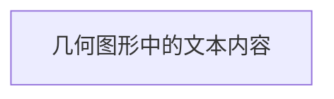
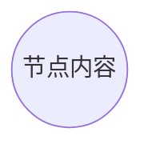
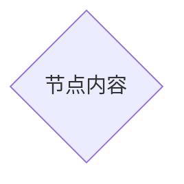
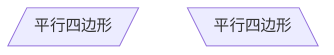

## 复选
- [x] Java
- [x] PHP

- [ ] C#

## 流程图

~~~markdown
```mermaid
<!-- 此处的内容会被渲染成 mermaid 图形 -->
`
~~~

| 标志 | 方向                  |
| ---- | --------------------- |
| TB   | top bottom – 从上到下 |
| BT   | bottom top – 从下到上 |
| RL   | right left – 从右到左 |
| LR   | left right - 从左到右 |
| TD   | 等同于TB              |

```mermaid
graph TD
开始 --> 结束
```


### 几何节点

#### 普通节点

在 Mermaid 语法中，不加任何修饰的文字内容会被渲染成几何图形节点。

~~~markdown

~~~

如：


#### 分离节点的 ID 与内容

````markdown

````

如：


### 节点形状

#### 圆角形节点

````markdown

````

如：


#### 圆形节点

````markdown

````

如：


#### 非对称形节点

````markdown

````

如：


#### 菱形节点

````markdown

````

如：


#### 六角形节点

````markdown

````

如：


#### 平行四边形节点

````markdown

````

如：


#### 梯形节点

````markdown

````

如：


### 子图表

````markdown
```mermaid
graph TD
节点1[节点内容] --> 

```
````

如：

```mermaid
graph TD
开始(内容1) --> 节点2[内容2]
subgraph sub1
节点2[内容2]--> 节点3((dd))
节点3-->判断{判断}
判断{判断}--> Y(是)
判断{判断}--> N(否)
end
Y --> 结束
N --> 结束
```


## 连线

````markdown
```mermaid
graph TD
不带文字的连线 -->  节点2
带文字的连线 -- 文字 -->  节点2
```

文字前面是两个短杠，后面是正常的连线格式
````

如：

```mermaid
graph TD
不带文字的连线 -->  节点2
带文字的连线 -- 文字 -->  节点3
```


### 基本连接线

~~~markdown
```mermaid
graph LR
    A-->B
```
~~~

如：

```mermaid
graph LR
A --> B
```

### 无向线段连接线

~~~markdown
```mermaid
graph LR
    A --- B -- 带文字连接线 --- C
```
~~~

如：

```mermaid
graph LR
    A --- B -- 文字 --- C
```

### 点状连接线

~~~markdown
```mermaid
graph LR
    A -.- B -. 带文字连接线 .-> C
```
~~~

如：

```mermaid
graph LR
    A -.- B -. 带文字连接线 .-> C
```

### 粗实连接线

~~~markdown
```mermaid
graph LR
    A ==> B == 带文字连接线 ==> C
```
~~~

如

```mermaid
graph LR
    A ==> B == 带文字连接线 ==> C
```


### 复杂案例：冒泡排序

```markdown
```mermaid
graph LR
	执行1[i = 1]
  执行2[j = 0]
  执行3[i ++]
  执行4["a = arr[j], b = arr[j + 1]"]
  执行5[交换 a, b]
  执行6[j ++]
	判断1["i < n"]
	判断2["j < n - i"]
  判断3["a > b"]
  开始 --> 执行1
  执行1 --> 判断1
  判断1 --Y--> 执行2
  执行2 --> 判断2
  判断2 --Y--> 执行4
  判断2 --N--> 执行3
  执行3 --> 判断1
  执行4 --> 判断3
  判断3 --N--> 判断2
  判断3 --Y--> 执行5
  执行5 --> 执行6
  执行6 --> 判断2
  判断1 --N--> 结束
```
```


```mermaid
graph LR
	执行1[i = 1]
  执行2[j = 0]
  执行3[i ++]
  执行4["a = arr[j], b = arr[j + 1]"]
  执行5[交换 a, b]
  执行6[j ++]
	判断1["i < n"]
	判断2["j < n - i"]
  判断3["a > b"]
  开始 --> 执行1
  执行1 --> 判断1
  判断1 --Y--> 执行2
  执行2 --> 判断2
  判断2 --Y--> 执行4
  判断2 --N--> 执行3
  执行3 --> 判断1
  执行4 --> 判断3
  判断3 --N--> 判断2
  判断3 --Y--> 执行5
  执行5 --> 执行6
  执行6 --> 判断2
  判断1 --N--> 结束
```


## 时序图

语法：

~~~markdown
```mermaid
sequenceDiagram
    [发起者][连线类型][接收者]:消息内容
```
~~~

| 类型 | 描述                                 |
| :--- | :----------------------------------- |
| ->   | （一横）没有箭头的实线               |
| –->  | （两横）没有箭头的虚线               |
| ->>  | （一横）有箭头的实线                 |
| –->> | （两横）有箭头的虚线                 |
| -x   | （一横）有交叉箭头的实线（表示异步） |
| –-x  | （两横）有交叉箭头的虚线（表示异步） |

如：

````markdown
```mermaid
sequenceDiagram
    李雷->>韩梅梅: Hi LiLei, How do you do?
    韩梅梅-->>李雷: How do you do!
```
````


```mermaid
sequenceDiagram
    李雷->>韩梅梅: Hi LiLei, How do you do?
    韩梅梅-->>李雷: How do you do!
```


### 别名

~~~markdown
```mermaid
sequenceDiagram
    participant z as 张三
    participant l as 李四
    z->>l: 吃饭没?
    l->>z: 你好呀，我已经吃过了，你呢?
    z-->l: 我也吃过了.
```
~~~

如：

```mermaid
sequenceDiagram
        participant z as 张三
    participant l as 李四
    z->>l: 吃饭没?
    l->>z: 你好呀，我已经吃过了，你呢?
    z-->>l: 我也吃过了.
```


### 聚焦

~~~markdown
```mermaid
sequenceDiagram
    l->>h: 你好，你叫啥?
    activate h
    h-->>l: 你好,我叫李四!
    deactivate h
```
~~~

如：

```mermaid
sequenceDiagram
     l->>h: 你好，你叫啥?
    activate h
    h-->>l: 你好,我叫李四!
    deactivate h
```

#### 简写

聚焦可以使用 `+` / `-` 符号简化书写。

~~~markdown
```mermaid
sequenceDiagram
    l->>+h: 你好，你叫啥?
    h-->>-l: 你好,我叫李四!
```
~~~

如：

```mermaid
sequenceDiagram
   l->>+h: 你好，你叫啥?
    h-->>-l: 你好,我叫李四!
```

### 备注

~~~markdown
```mermaid
l ->> h: 你好
	note right of h: 右备注
	note left of l: 左备注
	note over l,h: 悬浮备注
h->> l: Welcome!
```
~~~

如：

```mermaid
sequenceDiagram
l ->> h: 你好
	note right of h: 右备注
	note left of l: 左备注
	note over l,h: 悬浮备注
h->> l: Welcome!
```

###  循环

~~~markdown
```mermaid
sequenceDiagram
    l->h: 你好?
    loop 不停地说
        h-->l: 好!
    end
```
~~~

如：

```mermaid
sequenceDiagram
    l->h: 你好?
    loop 不停地说
        h-->l: 好!
    end
```

